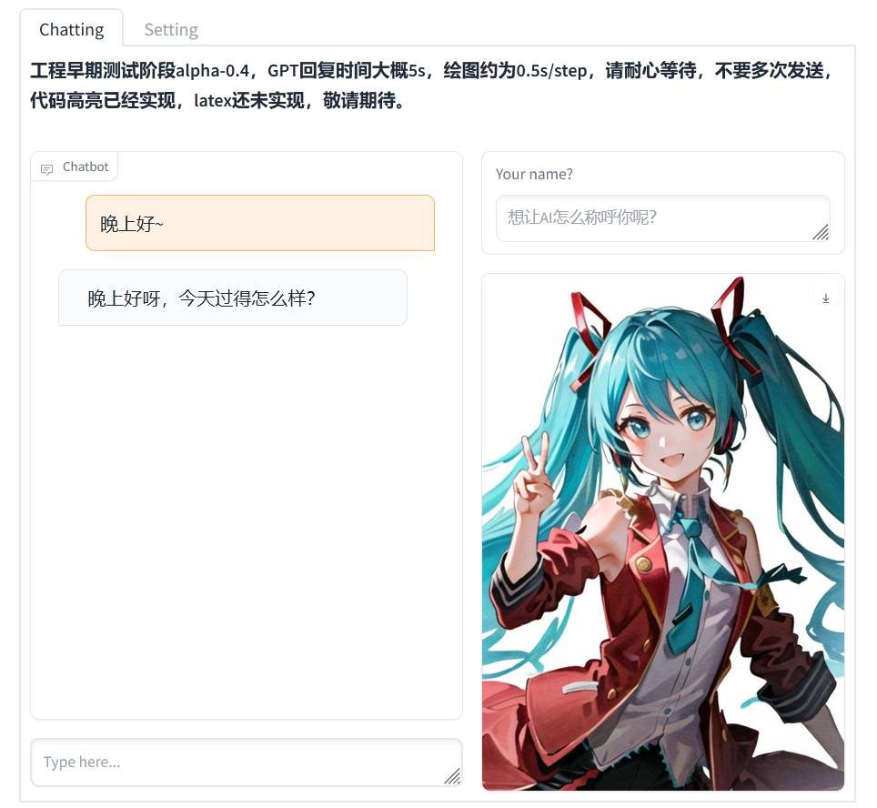

# ChatWaifu
Your virtual companian/waifu powered by chatgpt and other state-of-the-art AI models

# preview

# install
 1. install requirements
```bash
git clone https://github.com/SynodicMonth/ChatWaifu.git
pip install -r requirements.txt
```
 2. install automatic1111's stable-diffusion-webui
    follow the instructions in https://github.com/AUTOMATIC1111/stable-diffusion-webui
    launch the stable-diffusion-webui with `--api` flag
    set the url of the diffusion webui server in `interface.py`
 3. prepare a openai api key (starting with `sk-`) and put it in `openai_api_key.txt`
 4. run `python interface.py`
 5. open `http://localhost:7680` in your browser and chat with your waifu

# using
 - follow the install instructions above, and enjoy chatting to your waifu.
 - chatgpt pass can be disabled in the settings, if so, the prompt will be passed directy to the diffusion.
 - diffusion pass can be disabled in the settings, if so, no image will be generated.

# customize your waifu
 - create a yaml file using the template [miku.yaml](./presets/miku.yaml)
 - `id`:the name of our waifu to show in the character list
 - `ai_nickname`: the nickname of your waifu used in the coversation
 - `system_prompt`: system prompt used in the chatgpt, write your waifu's background, personality and tongue here.
 - `diffusion_positive_prompt`: positive prompt for stable diffusion, write your waifu's appearance and outfit here, if a lora is used, put the lora tag here like `<lora:xiao:0.7>`
 - `diffusion_negative_prompt`: negative prompt for stable diffusion, use this accompany with the positive prompt.


**any issues? feel free to open an issue, any PRs are welcomed!**
# credits
   - [stable-diffusion-webui](https://github.com/AUTOMATIC1111/stable-diffusion-webui)
   - [gradio](https://gradio.app/)
   - [chatgpt](https://openai.com/blog/chatgpt)